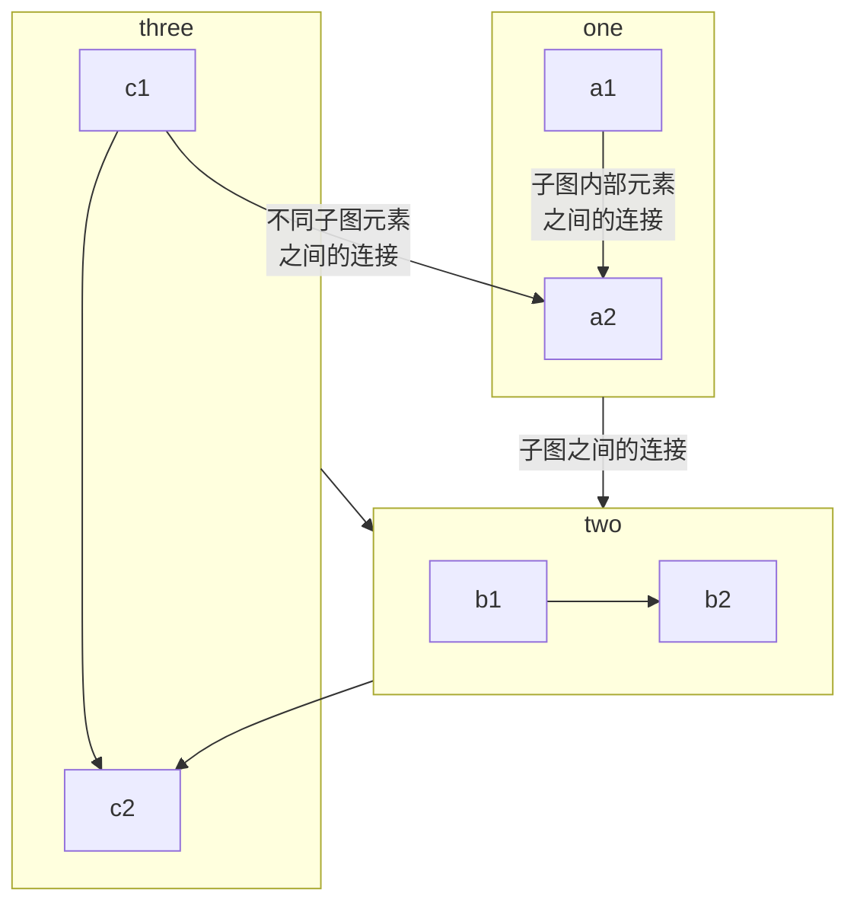

# HRankFL

## 开始
+ localSet目录存放内容
+ results/vgg目录存放内容

## 架构

+ model：网络模型实例——通道调整创建、原型模型实例类变量
+ pruningInfo：剪枝控制信息实例——提供控制信息计算更新、模型密度获取
+ vdevice：设备控制实例（封装model）——模型和张量的加载、模型序列化与反序列化
+ vwrapper：运行时实例（封装vdevice）——训练时损失函数和优化函数、训练和测试、运行时配置保存、模型训练开销测算
+ vhrank：剪枝算法实例（封装vwrapper）——算法运行、模型参数更新、通信参数规范
+ node：运行结点实例（封装vhrank）——装配loader和算法实例、通信交互

## 开发日志

### 待实现

+ argParser & runtimeEnv：参数解析器与执行环境的绑定
+ pathHandler：路径绑定与加载器
+ vdevice：模型的序列化与反序列化
+ vwrapper：模型训练时配置加载与保存，模型训练时开销测算
+ dynamicChange：网络模型结构固化或是动态变化
+ hyperProvider：剪枝参数自适应给出
+ model：原型模型参数类变量创建
+ autoParser：Json配置与解析
+ 注释补充与函数接口完善
+ args&runtimeEnv：command和json配置协调

## 难点

+ 剪枝参数的确定，是一个超参数
+ 为什么要判断learning rate一样
+ 怎样保证master节点和worker节点上的模型都收敛

## 需求

+ 给定一个损失精度-5%，然后求得最小网络子结构，获得网络中各卷积层的通道数

## 不合理

+ datasettype datatype
+ data_per_client = local_update_epoch * batch_size

## 依赖库

+ torch, torchaudio, torchvision
+ DecDeprecated, fedlab
